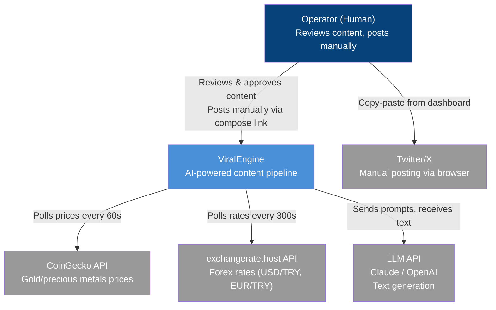

# C1: System Context Diagram

```mermaid
graph TB
    User["Operator (Human)
    Reviews content, posts manually"]

    VE["ViralEngine
    AI-powered content pipeline"]

    CG["CoinGecko API
    Gold/precious metals prices"]

    ER["exchangerate.host API
    Forex rates (USD/TRY, EUR/TRY)"]

    LLM["LLM API
    Claude / OpenAI
    Text generation"]

    TW["Twitter/X
    Manual posting via browser"]

    User -->|"Reviews & approves content
    Posts manually via compose link"| VE
    VE -->|"Polls prices every 60s"| CG
    VE -->|"Polls rates every 300s"| ER
    VE -->|"Sends prompts, receives text"| LLM
    User -->|"Copy-paste from dashboard"| TW

    style VE fill:#4a90d9,color:#fff
    style User fill:#08427b,color:#fff
    style CG fill:#999,color:#fff
    style ER fill:#999,color:#fff
    style LLM fill:#999,color:#fff
    style TW fill:#999,color:#fff
```
