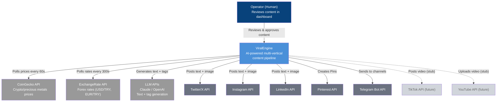

# C1: System Context Diagram

```mermaid
graph TB
    User["Operator (Human)
    Reviews content in dashboard"]

    VE["ViralEngine
    AI-powered multi-vertical
    content pipeline"]

    CG["CoinGecko API
    Crypto/precious metals prices"]

    ER["ExchangeRate API
    Forex rates (USD/TRY, EUR/TRY)"]

    LLM["LLM APIs
    Claude / OpenAI
    Text + tag generation"]

    TW["Twitter/X API"]
    IG["Instagram API"]
    LI["LinkedIn API"]
    PI["Pinterest API"]
    TG["Telegram Bot API"]
    TT["TikTok API (future)"]
    YT["YouTube API (future)"]

    User -->|"Reviews & approves content"| VE
    VE -->|"Polls prices every 60s"| CG
    VE -->|"Polls rates every 300s"| ER
    VE -->|"Generates text + tags"| LLM
    VE -->|"Posts text + image"| TW
    VE -->|"Posts text + image"| IG
    VE -->|"Posts text + image"| LI
    VE -->|"Creates Pins"| PI
    VE -->|"Sends to channels"| TG
    VE -.->|"Posts video (stub)"| TT
    VE -.->|"Uploads video (stub)"| YT

    style VE fill:#4a90d9,color:#fff
    style User fill:#08427b,color:#fff
    style CG fill:#999,color:#fff
    style ER fill:#999,color:#fff
    style LLM fill:#999,color:#fff
    style TW fill:#6b7280,color:#fff
    style IG fill:#6b7280,color:#fff
    style LI fill:#6b7280,color:#fff
    style PI fill:#6b7280,color:#fff
    style TG fill:#6b7280,color:#fff
    style TT fill:#d1d5db,color:#666
    style YT fill:#d1d5db,color:#666
```
