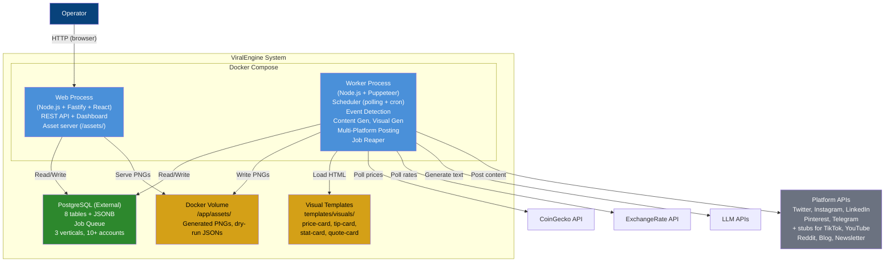

# C2: Container Diagram

```mermaid
graph TB
    subgraph "ViralEngine System"
        subgraph "Docker Compose"
            Web["Web Process
            (Node.js + Fastify + React)
            REST API + Dashboard
            Asset server (/assets/)"]

            Worker["Worker Process
            (Node.js + Puppeteer)
            Scheduler (polling + cron)
            Event Detection
            Content Gen, Visual Gen
            Multi-Platform Posting
            Job Reaper"]
        end

        Volume["Docker Volume
        /app/assets/
        Generated PNGs, dry-run JSONs"]

        Templates["Visual Templates
        templates/visuals/
        price-card, tip-card,
        stat-card, quote-card"]

        DB["PostgreSQL (External)
        8 tables + JSONB
        Job Queue
        3 verticals, 10+ accounts"]
    end

    User["Operator"] -->|"HTTP (browser)"| Web
    Web -->|"Read/Write"| DB
    Worker -->|"Read/Write"| DB
    Worker -->|"Write PNGs"| Volume
    Web -->|"Serve PNGs"| Volume
    Worker -->|"Load HTML"| Templates

    Worker -->|"Poll prices"| CG["CoinGecko API"]
    Worker -->|"Poll rates"| ER["ExchangeRate API"]
    Worker -->|"Generate text"| LLM["LLM APIs"]
    Worker -->|"Post content"| Platforms["Platform APIs
    Twitter, Instagram, LinkedIn
    Pinterest, Telegram
    + stubs for TikTok, YouTube
    Reddit, Blog, Newsletter"]

    style Web fill:#4a90d9,color:#fff
    style Worker fill:#4a90d9,color:#fff
    style DB fill:#2d882d,color:#fff
    style Volume fill:#d4a017,color:#000
    style Templates fill:#d4a017,color:#000
    style User fill:#08427b,color:#fff
    style Platforms fill:#6b7280,color:#fff
```
