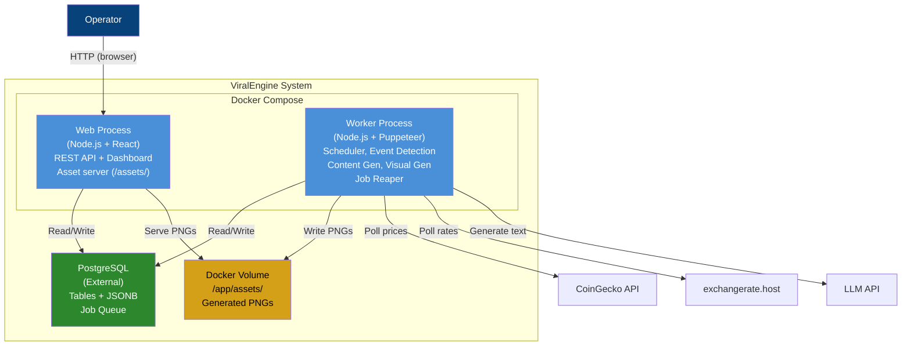

# C2: Container Diagram

```mermaid
graph TB
    subgraph "ViralEngine System"
        subgraph "Docker Compose"
            Web["Web Process
            (Node.js + React)
            REST API + Dashboard
            Asset server (/assets/)"]

            Worker["Worker Process
            (Node.js + Puppeteer)
            Scheduler, Event Detection
            Content Gen, Visual Gen
            Job Reaper"]
        end

        Volume["Docker Volume
        /app/assets/
        Generated PNGs"]

        DB["PostgreSQL
        (External)
        Tables + JSONB
        Job Queue"]
    end

    User["Operator"] -->|"HTTP (browser)"| Web
    Web -->|"Read/Write"| DB
    Worker -->|"Read/Write"| DB
    Worker -->|"Write PNGs"| Volume
    Web -->|"Serve PNGs"| Volume

    Worker -->|"Poll prices"| CG["CoinGecko API"]
    Worker -->|"Poll rates"| ER["exchangerate.host"]
    Worker -->|"Generate text"| LLM["LLM API"]

    style Web fill:#4a90d9,color:#fff
    style Worker fill:#4a90d9,color:#fff
    style DB fill:#2d882d,color:#fff
    style Volume fill:#d4a017,color:#000
    style User fill:#08427b,color:#fff
```
