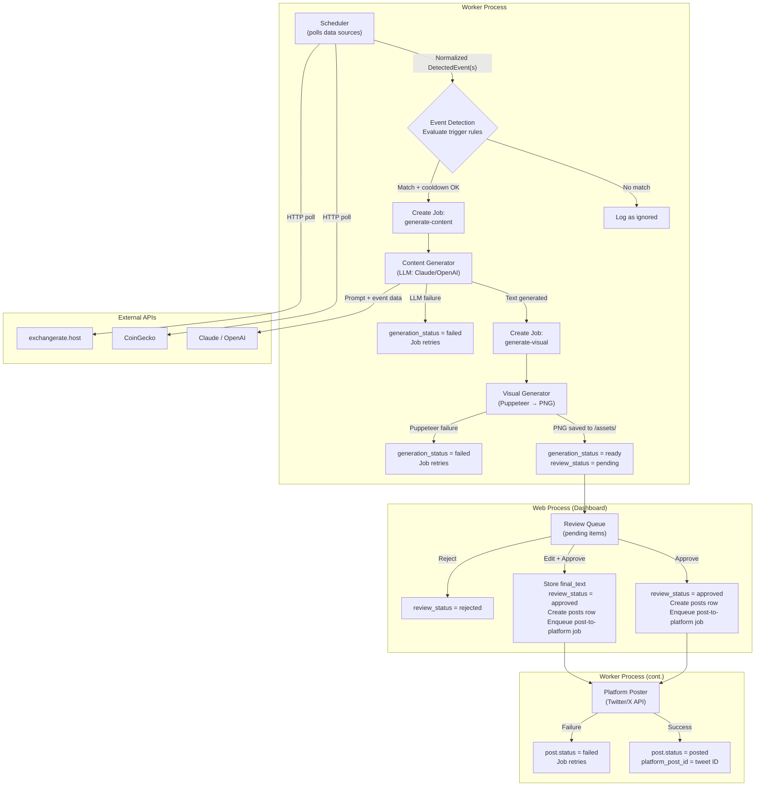
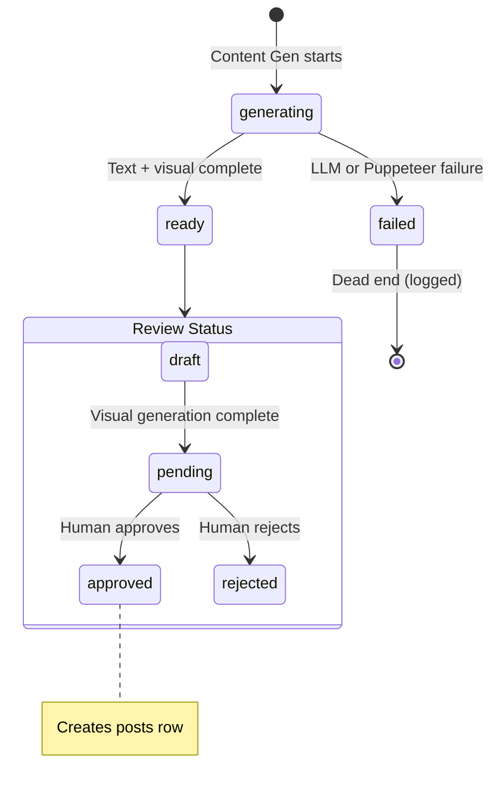

# C3: Pipeline Flow

```mermaid
flowchart TD
    subgraph "Worker Process"
        S["Scheduler
        (polls data sources)"]

        S -->|"Normalized DetectedEvent(s)"| ED

        ED{"Event Detection
        Evaluate trigger rules"}

        ED -->|"No match"| IGN["Log as ignored"]
        ED -->|"Match + cooldown OK"| JQ1["Create Job:
        generate-content"]

        JQ1 --> CG["Content Generator
        (LLM: Claude/OpenAI)"]

        CG -->|"Text generated"| JQ2["Create Job:
        generate-visual"]
        CG -->|"LLM failure"| FAIL1["generation_status = failed
        Job retries"]

        JQ2 --> VG["Visual Generator
        (Puppeteer → PNG)"]

        VG -->|"PNG saved to /assets/"| READY["generation_status = ready
        review_status = pending"]
        VG -->|"Puppeteer failure"| FAIL2["generation_status = failed
        Job retries"]
    end

    subgraph "Web Process (Dashboard)"
        READY --> RQ["Review Queue
        (pending items)"]

        RQ -->|"Approve"| APP["review_status = approved
        Create posts row
        Enqueue post-to-platform job"]
        RQ -->|"Edit + Approve"| EDIT["Store final_text
        review_status = approved
        Create posts row
        Enqueue post-to-platform job"]
        RQ -->|"Reject"| REJ["review_status = rejected"]
    end

    subgraph "Worker Process (cont.)"
        APP --> POST["Platform Poster
        (Twitter/X API)"]
        EDIT --> POST

        POST -->|"Success"| DONE["post.status = posted
        platform_post_id = tweet ID"]
        POST -->|"Failure"| PFAIL["post.status = failed
        Job retries"]
    end

    subgraph "External APIs"
        CG_API["CoinGecko"]
        ER_API["exchangerate.host"]
        LLM_API["Claude / OpenAI"]
    end

    S -->|"HTTP poll"| CG_API
    S -->|"HTTP poll"| ER_API
    CG -->|"Prompt + event data"| LLM_API
```

# Content Item State Machine

```mermaid
stateDiagram-v2
    [*] --> generating: Content Gen starts
    generating --> ready: Text + visual complete
    generating --> failed: LLM or Puppeteer failure

    state "Review Status" as review {
        draft --> pending: Visual generation complete
        pending --> approved: Human approves
        pending --> rejected: Human rejects
    }

    ready --> review
    failed --> [*]: Dead end (logged)

    note right of approved: Creates posts row
```
