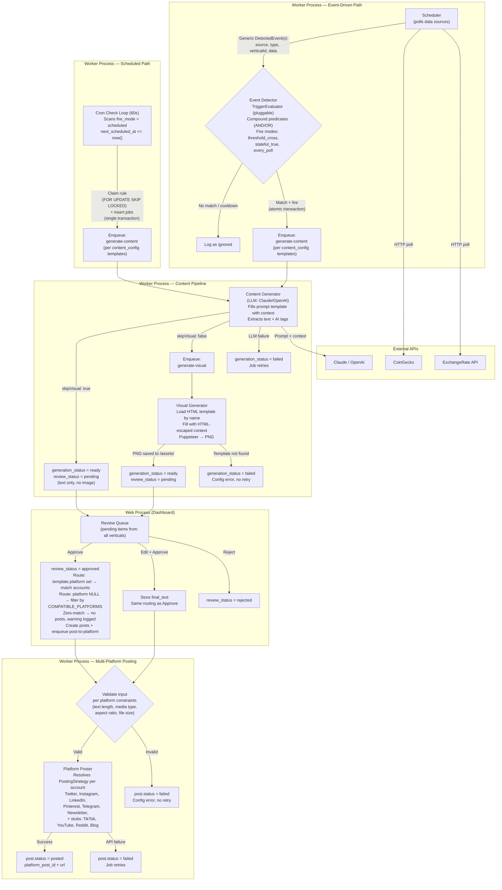
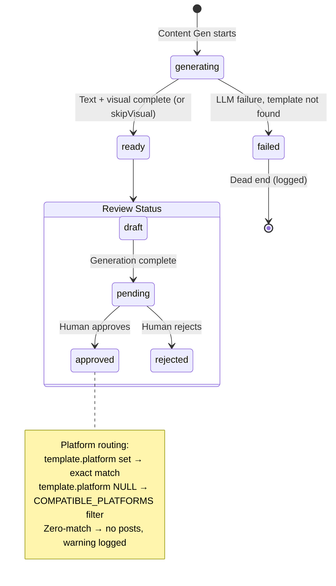
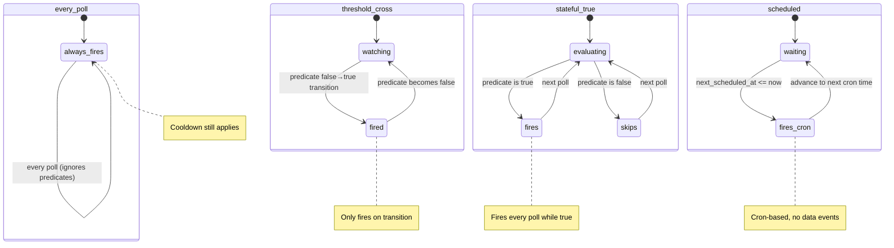

# C3: Pipeline Flow

```mermaid
flowchart TD
    subgraph "Worker Process — Event-Driven Path"
        S["Scheduler
        (polls data sources)"]

        S -->|"Generic DetectedEvent(s)
        source, type, verticalId, data"| ED

        ED{"Event Detector
        TriggerEvaluator (pluggable)
        Compound predicates (AND/OR)
        Fire modes: threshold_cross,
        stateful_true, every_poll"}

        ED -->|"No match / cooldown"| IGN["Log as ignored"]
        ED -->|"Match + fire
        (atomic transaction)"| JQ1["Enqueue:
        generate-content
        (per content_config templates)"]
    end

    subgraph "Worker Process — Scheduled Path"
        CRON["Cron Check Loop (60s)
        Scans fire_mode = scheduled
        next_scheduled_at <= now()"]

        CRON -->|"Claim rule
        (FOR UPDATE SKIP LOCKED)
        + insert jobs
        (single transaction)"| JQ1S["Enqueue:
        generate-content
        (per content_config templates)"]
    end

    subgraph "Worker Process — Content Pipeline"
        JQ1 --> CG
        JQ1S --> CG

        CG["Content Generator
        (LLM: Claude/OpenAI)
        Fills prompt template with context
        Extracts text + AI tags"]

        CG -->|"skipVisual: true"| READY_TEXT["generation_status = ready
        review_status = pending
        (text only, no image)"]
        CG -->|"skipVisual: false"| JQ2["Enqueue:
        generate-visual"]
        CG -->|"LLM failure"| FAIL1["generation_status = failed
        Job retries"]

        JQ2 --> VG["Visual Generator
        Load HTML template by name
        Fill with HTML-escaped context
        Puppeteer → PNG"]

        VG -->|"PNG saved to /assets/"| READY["generation_status = ready
        review_status = pending"]
        VG -->|"Template not found"| FAIL2["generation_status = failed
        Config error, no retry"]
    end

    subgraph "Web Process (Dashboard)"
        READY --> RQ
        READY_TEXT --> RQ

        RQ["Review Queue
        (pending items from all verticals)"]

        RQ -->|"Approve"| APP["review_status = approved
        Route: template.platform set → match accounts
        Route: platform NULL → filter by COMPATIBLE_PLATFORMS
        Zero-match → no posts, warning logged
        Create posts + enqueue post-to-platform"]
        RQ -->|"Edit + Approve"| EDIT["Store final_text
        Same routing as Approve"]
        RQ -->|"Reject"| REJ["review_status = rejected"]
    end

    subgraph "Worker Process — Multi-Platform Posting"
        APP --> VAL
        EDIT --> VAL

        VAL{"Validate input
        per platform constraints
        (text length, media type,
        aspect ratio, file size)"}

        VAL -->|"Valid"| POST["Platform Poster
        Resolves PostingStrategy per account
        Twitter, Instagram, LinkedIn,
        Pinterest, Telegram, Newsletter,
        + stubs: TikTok, YouTube, Reddit, Blog"]
        VAL -->|"Invalid"| VFAIL["post.status = failed
        Config error, no retry"]

        POST -->|"Success"| DONE["post.status = posted
        platform_post_id + url"]
        POST -->|"API failure"| PFAIL["post.status = failed
        Job retries"]
    end

    subgraph "External APIs"
        CG_API["CoinGecko"]
        ER_API["ExchangeRate API"]
        LLM_API["Claude / OpenAI"]
    end

    S -->|"HTTP poll"| CG_API
    S -->|"HTTP poll"| ER_API
    CG -->|"Prompt + context"| LLM_API
```

# Content Item State Machine

```mermaid
stateDiagram-v2
    [*] --> generating: Content Gen starts

    generating --> ready: Text + visual complete (or skipVisual)
    generating --> failed: LLM failure, template not found

    state "Review Status" as review {
        draft --> pending: Generation complete
        pending --> approved: Human approves
        pending --> rejected: Human rejects
    }

    ready --> review
    failed --> [*]: Dead end (logged)

    note right of approved
        Platform routing:
        template.platform set → exact match
        template.platform NULL → COMPATIBLE_PLATFORMS filter
        Zero-match → no posts, warning logged
    end note
```

# Trigger Rule Fire Modes

```mermaid
stateDiagram-v2
    state "threshold_cross" as TC {
        [*] --> watching
        watching --> fired: predicate false→true transition
        fired --> watching: predicate becomes false
        note right of fired: Only fires on transition
    }

    state "stateful_true" as ST {
        [*] --> evaluating
        evaluating --> fires: predicate is true
        evaluating --> skips: predicate is false
        fires --> evaluating: next poll
        skips --> evaluating: next poll
        note right of fires: Fires every poll while true
    }

    state "every_poll" as EP {
        [*] --> always_fires
        always_fires --> always_fires: every poll (ignores predicates)
        note right of always_fires: Cooldown still applies
    }

    state "scheduled" as SC {
        [*] --> waiting
        waiting --> fires_cron: next_scheduled_at <= now
        fires_cron --> waiting: advance to next cron time
        note right of fires_cron: Cron-based, no data events
    }
```
