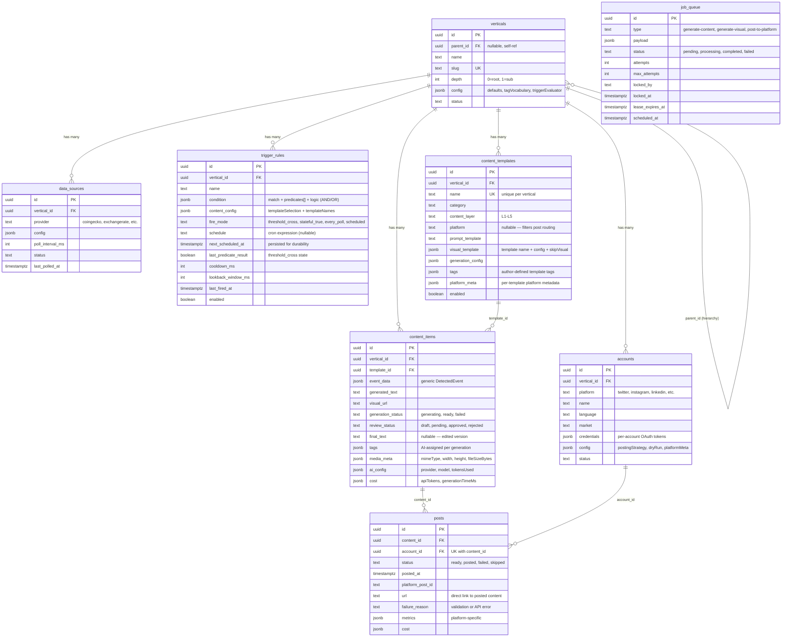

# C4: Data Model — Entity Relationships

## Platform Coverage (accounts.platform values)

| Platform | PostingStrategy | Status | Content Format |
|---|---|---|---|
| `twitter` | `twitter-api` | Full | Text + image |
| `instagram` | `instagram-api` | Full | Text + image (required) |
| `linkedin` | `linkedin-api` | Full | Text + image |
| `pinterest` | `pinterest-api` | Full | Text + image (required) |
| `telegram` | `telegram-api` | Full | Text + image |
| `newsletter` | `newsletter` | Stub (file) | Text + image (email HTML) |
| `tiktok` | `tiktok-api` | Stub (needs video) | Video required |
| `youtube` | `youtube-api` | Stub (needs video) | Video required |
| `reddit` | `reddit-api` | Stub (needs long-form) | Long text + subreddit |
| `blog` | `blog` | Stub (needs long-form) | HTML + SEO metadata |
| (any) | `dry-run` | Testing | Saves to JSON file |
