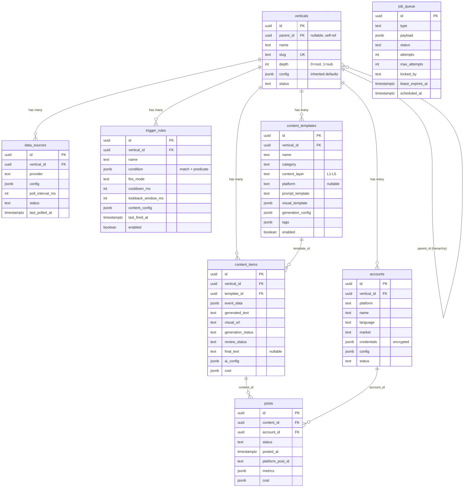

# C4: Data Model — Entity Relationships

```mermaid
erDiagram
    verticals ||--o{ verticals : "parent_id (hierarchy)"
    verticals ||--o{ accounts : "has many"
    verticals ||--o{ data_sources : "has many"
    verticals ||--o{ trigger_rules : "has many"
    verticals ||--o{ content_templates : "has many"
    verticals ||--o{ content_items : "has many"

    content_templates ||--o{ content_items : "template_id"
    content_items ||--o{ posts : "content_id"
    accounts ||--o{ posts : "account_id"

    verticals {
        uuid id PK
        uuid parent_id FK "nullable, self-ref"
        text name
        text slug UK
        int depth "0=root, 1=sub"
        jsonb config "inherited defaults"
        text status
    }

    accounts {
        uuid id PK
        uuid vertical_id FK
        text platform
        text name
        text language
        text market
        jsonb credentials "encrypted"
        jsonb config
        text status
    }

    data_sources {
        uuid id PK
        uuid vertical_id FK
        text provider
        jsonb config
        int poll_interval_ms
        text status
        timestamptz last_polled_at
    }

    trigger_rules {
        uuid id PK
        uuid vertical_id FK
        text name
        jsonb condition "match + predicate"
        text fire_mode
        int cooldown_ms
        int lookback_window_ms
        jsonb content_config
        timestamptz last_fired_at
        boolean enabled
    }

    content_templates {
        uuid id PK
        uuid vertical_id FK
        text name
        text category
        text content_layer "L1-L5"
        text platform "nullable"
        text prompt_template
        jsonb visual_template
        jsonb generation_config
        jsonb tags
        boolean enabled
    }

    content_items {
        uuid id PK
        uuid vertical_id FK
        uuid template_id FK
        jsonb event_data
        text generated_text
        text visual_url
        text generation_status
        text review_status
        text final_text "nullable"
        jsonb ai_config
        jsonb cost
    }

    posts {
        uuid id PK
        uuid content_id FK
        uuid account_id FK
        text status
        timestamptz posted_at
        text platform_post_id
        jsonb metrics
        jsonb cost
    }

    job_queue {
        uuid id PK
        text type
        jsonb payload
        text status
        int attempts
        int max_attempts
        text locked_by
        timestamptz lease_expires_at
        timestamptz scheduled_at
    }
```
