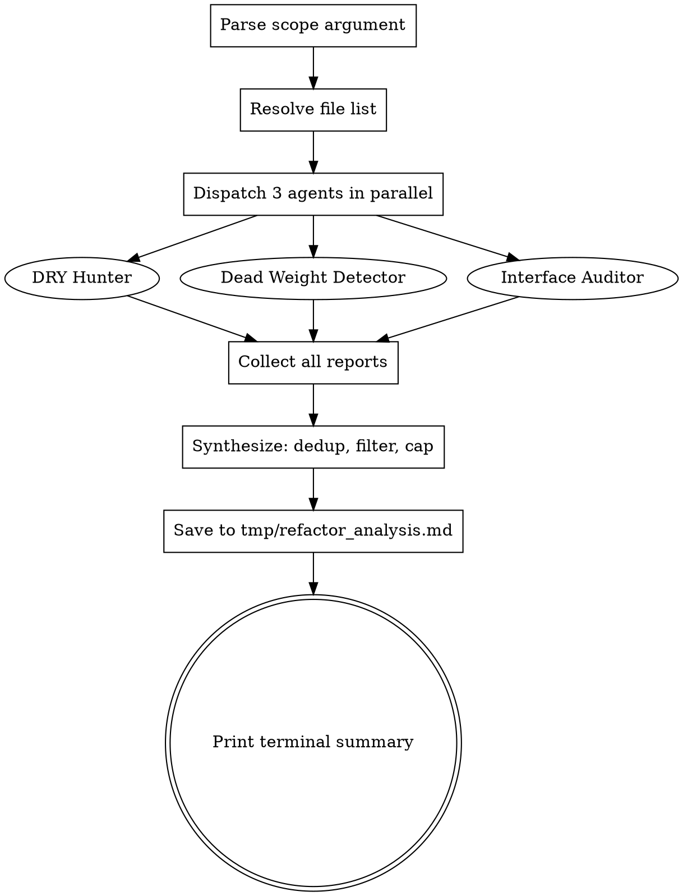

# Refactor Audit Skill — Design Spec

**Date:** 2026-03-21
**Scope:** Personal Claude Code skill for codebase-wide refactoring analysis
**Goal:** A `/refactor-audit` skill that dispatches three parallel agents to scan a codebase for DRY violations, dead code, and interface quality issues, then synthesizes findings into a prioritized report

---

## 1. Problem Statement

Existing Claude Code skills and agents cover post-hoc code review (reviewing recent changes) and post-implementation simplification (cleaning up what was just written). None proactively scan a codebase to discover cross-file DRY violations, dead code, bloated files, or tangled abstractions. This skill fills that gap.

---

## 2. Skill Location & Structure

**Location:** `~/.claude/skills/refactor-audit/` (personal skill, available across all projects)

```
~/.claude/skills/refactor-audit/
  SKILL.md                    # Main skill: scope parsing, orchestration, synthesis
  agents/
    dry-hunter.md             # Agent prompt: duplication detection
    dead-weight-detector.md   # Agent prompt: unused code, bloat, over-engineering
    interface-auditor.md      # Agent prompt: abstractions, boundaries, SRP, dependencies
```

**Invocation:** `/refactor-audit [scope]`

---

## 3. Scope Parsing

The skill accepts an optional scope argument. The main session parses it before dispatching agents.

| Invocation                              | Behavior                                                           |
| --------------------------------------- | ------------------------------------------------------------------ |
| `/refactor-audit`                       | Scans all files under `src/`                                       |
| `/refactor-audit src/worker`            | Scans only `src/worker/`                                           |
| `/refactor-audit src/shared src/worker` | Scans multiple paths                                               |
| `/refactor-audit --since HEAD~5`        | Scans files changed in last 5 commits (via `git diff --name-only`) |

**Parsing rules:**

- If argument starts with `--since`, run `git diff --name-only <ref>` to get the file list
- Otherwise, treat each space-separated token as a path to glob
- Default: `src/`
- Pass the resolved file list to all three agents so they scan the same scope

---

## 4. Agent Design

Three parallel Opus agents, each dispatched via the Agent tool with `model: "opus"` (resolves to Opus 4.6 [1M context]). If Claude Code adds an effort/reasoning parameter in the future, these agents should run at the highest available effort level. Each agent receives:

- The resolved file list (scope)
- Instruction to read project CLAUDE.md for conventions
- Instruction to include `file:line` references for every finding
- Instruction to assign a confidence score (0-100) to each finding

### 4.1 Agent 1: DRY Hunter

**File:** `agents/dry-hunter.md`

**Focus:** Code duplication and missing abstractions.

**What it looks for:**

- Near-identical code blocks across different files (similar function signatures, repeated logic patterns, copy-paste code)
- Repeated inline SQL queries, validation logic, error handling patterns, or data transformation code
- Opportunities for shared utilities, base classes, generic helpers, or higher-order functions
- Constants or config values duplicated across files instead of centralized

**Report format per finding:**

- Description of the duplication
- File:line references for each instance
- What abstraction could consolidate it (e.g., "extract to shared utility", "create base class")
- Confidence score (0-100)

### 4.2 Agent 2: Dead Weight Detector

**File:** `agents/dead-weight-detector.md`

**Focus:** Unused code, bloat, and over-engineering.

**What it looks for:**

- Unused exports: functions, types, or constants exported but never imported elsewhere in the scanned scope
- Unreferenced functions: defined but never called
- Dead code paths: branches behind impossible conditions, unreachable returns
- Files that have grown too large (multiple responsibilities crammed into one file)
- Over-engineering: abstractions with only one consumer, premature generalization, wrapper functions that just forward calls
- Unused dependencies (imports that are not used within the file)

**Report format per finding:**

- What is unused/bloated
- Evidence (grep results showing zero references, or file line count + responsibility list)
- Suggested action: delete, split, or inline
- Confidence score (0-100)

### 4.3 Agent 3: Interface Auditor

**File:** `agents/interface-auditor.md`

**Focus:** Module boundaries, abstraction quality, and dependency health.

**What it looks for:**

- SRP violations: files or classes doing too many unrelated things
- Leaky abstractions: consumers reaching through an interface to access implementation details (e.g., importing internal helpers from another module)
- Circular or tangled dependencies between modules
- Missing interfaces: concrete implementations passed around instead of abstractions
- God files: files that everything depends on, creating coupling bottlenecks
- Inconsistent patterns: same concern handled differently across modules (e.g., error handling in module A vs module B)

**Report format per finding:**

- What boundary is violated or what's tangled
- File:line references
- Suggested restructuring
- Confidence score (0-100)

---

## 5. Synthesis

After all three agents return, the main session (Opus) synthesizes their reports.

**Synthesis rules:**

1. **Deduplicate** — if multiple agents flag the same file/code region, merge into one finding with the most relevant category
2. **Filter** — drop findings with confidence below 40
3. **Cap** — maximum 20 findings in the report (prioritize by confidence descending)
4. **Categorize** by severity:
   - **Critical** (confidence >= 80): real maintenance risks, must address
   - **Important** (confidence 60-79): should address
   - **Minor** (confidence 40-59): worth noting

**Output location:** Always saved to `tmp/refactor_analysis.md` from the project root.

**Terminal output:** Print a brief summary (scope scanned, finding counts per severity tier, path to the full report). Not the full report.

### 5.1 Report Format

```markdown
## Refactor Audit Report

**Date:** YYYY-MM-DD HH:MM
**Scope:** [what was scanned — file count, line count, scope argument used]

### Critical (must address)

**1. [Finding title]** (confidence: N/100, category: DRY|dead-weight|interface)

- **Description:** [what the issue is]
- **Locations:** [file:line refs]
- **Suggested action:** [what to do about it]

[...more findings...]

### Important (should address)

[same format]

### Minor (worth noting)

[same format]

### Codebase Health Summary

[2-3 sentences: overall assessment, biggest risk area, what's clean]
```

---

## 6. SKILL.md Orchestration Flow

The SKILL.md instructs the main session to follow this sequence:

1. **Parse scope** — resolve the argument into a file list
2. **Count** — report file count and line count for the scope (quick `wc -l`)
3. **Dispatch** — launch all three agents in parallel via Agent tool, each reading their respective prompt file under `agents/`
4. **Wait** — all three agents return their findings
5. **Synthesize** — deduplicate, filter, cap, categorize, write report
6. **Save** — write full report to `tmp/refactor_analysis.md`
7. **Summarize** — print terminal summary with finding counts and file path



---

## 7. Agent Prompt Guidelines

Each agent prompt file (`agents/*.md`) follows this structure:

```markdown
---
name: [agent-name]
description: [what it does]
model: opus
---

## Mission

[One sentence: what you're looking for]

## Inputs

- File list to scan (provided in dispatch prompt)
- Project conventions from CLAUDE.md (read it first)

## What to Look For

[Detailed checklist — specific to this agent's focus area]

## What to Ignore

[Explicit exclusions to reduce false positives]

## Output Format

Return findings as a structured list:

- Finding title
- Description
- File:line references
- Suggested action
- Confidence score (0-100)

## Confidence Scoring Guide

- 0-39: Uncertain, might be intentional
- 40-59: Likely an issue but minor impact
- 60-79: Real issue with measurable impact
- 80-100: Clear problem, verified with evidence (grep results, dependency traces)
```

---

## 8. Files Created

| Action | Path                                                             | Purpose                                                            |
| ------ | ---------------------------------------------------------------- | ------------------------------------------------------------------ |
| Create | `~/.claude/skills/refactor-audit/SKILL.md`                       | Main skill: scope parsing, orchestration, synthesis, report format |
| Create | `~/.claude/skills/refactor-audit/agents/dry-hunter.md`           | Agent prompt for duplication detection                             |
| Create | `~/.claude/skills/refactor-audit/agents/dead-weight-detector.md` | Agent prompt for unused code and bloat detection                   |
| Create | `~/.claude/skills/refactor-audit/agents/interface-auditor.md`    | Agent prompt for abstraction and dependency analysis               |

---

## 9. Success Criteria

- `/refactor-audit` runs without errors on a 50+ file TypeScript codebase
- All three agents return findings within their scope (no hallucinated file paths)
- Report is saved to `tmp/refactor_analysis.md` with correct formatting
- Findings include `file:line` references that can be verified
- Confidence scoring is calibrated: high-confidence findings are real issues, low-confidence findings are genuinely uncertain
- Duplicate findings across agents are merged, not listed separately
- Report stays under 20 findings — actionable, not overwhelming
- Terminal summary is concise (< 10 lines)
